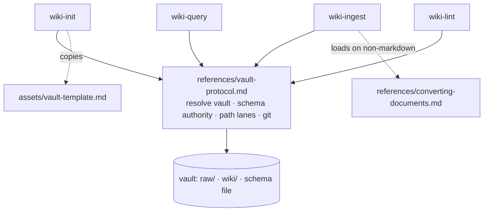

# Plan: LLM Wiki Plugin

| Name            | Code     | Version | Date       | Status |
| ---             | ---      | ---     | ---        | ---    |
| llm-wiki-plugin | PLAN-001 | R01     | 2026-08-23 | Approved |

## Approach

Ship four skills as markdown instructions and nothing else. The rules every skill shares — how to resolve the vault, why the vault's schema outranks the plugin, which operations use file tools versus the shell, and how to commit — are written once in a protocol reference at the plugin root that each skill loads as its first step, so the four skills cannot drift apart on the contract that US5 and US6 make testable. Everything the old version delegated to a Python graph tool is either a documented one-line shell pipeline or is not done at all, per the spec's non-goals.

## Constitution Check

- **Tech Stack**: Aligned. Markdown only; no language runtime, no build, no test framework. Skills auto-discovered from `skills/`.
- **Code Principles**: The schema-authority MUST is satisfied structurally — it lives in `references/vault-protocol.md`, loaded before any write, rather than being restated in four places. The no-executable-code MUST holds: every deterministic check is a shell one-liner documented inside a skill, never a checked-in script. Trigger phrases and their boundaries are fixed in this plan's `API / Interface Contracts`. The under-1,000-words SHOULD is met by moving the shared protocol out of the skills and format conversion into a reference.
- **Security**: `raw/` immutability and the untrusted-content rule are stated in the protocol reference and repeated in `wiki-ingest`, the only skill that reads sources — the one place where the trust boundary is actually crossed. Selective staging is enforced by the protocol's commit procedure, which stages named paths only. Destructive actions in lint require user approval per finding.
- **Operational Principles**: Commit-per-operation, atomicity, and raw-enters-with-its-ingest live in the protocol's git procedure. The contradiction rule is in `wiki-ingest` and re-checked in `wiki-lint`. The schema co-evolution SHOULD is assigned to `wiki-lint`, which proposes amendments to the vault's schema file and commits them with a `schema:` label — no separate skill, and no unowned principle.
- **Observability**: The log-entry MUST is part of the protocol's write procedure, so every writing skill appends one entry in the same parseable format. No third bookkeeping file is introduced.
- **Performance**: Index-first reading is the protocol's retrieval rule. The scale ceiling is checked by `wiki-lint` with a page count and reported when crossed, satisfying the MUST to say so rather than degrade silently.
- **Dependency Policy**: Zero dependencies. `grep`, `find`, `git`, and Obsidian's own features cover every need the graph script previously served; converters are detected at use time and never required.
- **Constraints**: Offline by default. Foreign vaults are handled by schema authority. Host portability is handled by the protocol's path discipline. `docs/llm-wiki.md` is committed and credited in `README.md`.

## NFR Compliance

- **Schema read before any write**: Step 1 of every skill loads `references/vault-protocol.md`, whose first instruction is to read the vault's schema file.
- **Vault root resolved explicitly, never assumed to be the working directory**: The protocol resolves an absolute vault root once per invocation and derives every path from it. No skill uses `cd` or a bare relative path.
- **File tools for pages, shell for git and read-only queries**: The protocol assigns each operation to one lane and requires paths reported by shell commands to be re-resolved against the vault root before a file tool touches them.
- **Functions with no converters installed**: `wiki-ingest` probes for a converter and, on absence, reports what is missing and how to convert, leaving the rest of the plugin usable.
- **Each SKILL.md under 1,000 words** (a constitution SHOULD and a spec Success Metric, no longer a duplicated NFR): Budgeted below — the shared protocol and the conversion reference absorb what would otherwise inflate the skills.
- **Interrupted operation leaves a git-describable state**: The protocol commits once, at the end, after all writes for the operation are complete; an interruption leaves uncommitted changes that `git status` and `git diff` fully describe.

## Architecture

Four skills, one shared protocol, one conversion reference, one schema template. The protocol is the only thing all four depend on; nothing else is shared. The template is an asset — copied into the user's vault, never read for guidance.



## File Structure

```text
.claude-plugin/plugin.json                          ← modified: version 2.0.0, new description
.claude-plugin/marketplace.json                     ← modified: version 2.0.0, new description
.gitignore                                          ← new: .DS_Store only
README.md                                           ← new: purpose, install, scale ceiling, credit to docs/llm-wiki.md
CHANGELOG.md                                        ← new: 2.0.0 entry naming what was removed
docs/llm-wiki.md                                    ← existing, untracked: committed as the source pattern
references/vault-protocol.md                        ← new: the contract all four skills load first
skills/wiki-init/SKILL.md                           ← new: scaffold a vault
skills/wiki-init/assets/vault-template.md           ← new: schema file written into the user's vault
skills/wiki-ingest/SKILL.md                         ← new: file a source
skills/wiki-ingest/references/converting-documents.md  ← new: per-format conversion guidance
skills/wiki-ingest/references/batch-ingest.md       ← new, conditional: only if batch mode pushes SKILL.md over 1,000 words
skills/wiki-query/SKILL.md                          ← new: answer with citations, file syntheses
skills/wiki-lint/SKILL.md                           ← new: health check, schema amendments, scale ceiling
```

## Data Model

The vault, as created by `wiki-init` and described by the schema file it writes:

```text
<vault>/
├── CLAUDE.md            schema file — authority over every skill
├── raw/                 immutable sources; uncommitted files are the inbox
├── wiki/
│   ├── index.md         catalog: one line per page, by category — the retrieval layer
│   ├── log.md           append-only: ## [YYYY-MM-DD] <op> | <subject>
│   ├── overview.md      evolving top-level synthesis
│   ├── sources/         one page per ingested source, carries `source:`
│   ├── syntheses/       filed answers
│   └── <categories>/    tailored to the vault's stated purpose
```

Page frontmatter, minimal by decision — no retrieval hooks, per the spec's non-goals:

```yaml
---
type: source | synthesis | <category singular>
created: YYYY-MM-DD
updated: YYYY-MM-DD
tags: []
---
```

Source pages add `source:` (the original filename in `raw/`) and `source-date:` when known. `source:` is what makes un-ingested sources detectable without a script.

## API / Interface Contracts

The plugin's real interface is which skill claims which user phrase. Each description states its boundary against its nearest neighbour, satisfying the spec's trigger-separation metric.

| Skill | Claims | Explicit boundary |
|---|---|---|
| `wiki-init` | "init a wiki", "set up a vault", "crea una wiki aquí" | Refuses if the folder is already a vault; offers lint instead |
| `wiki-ingest` | "ingest this", "process this source", "add this to the wiki", "what's pending" | Requires a file in `raw/`; a question about existing content is query's |
| `wiki-query` | "what does the wiki say about…", "based on my notes", "compare X and Y" | Reads and answers; never files a source |
| `wiki-lint` | "lint the wiki", "health check", "clean up the wiki" | Proposes and, on approval, fixes; never answers questions |

Shell commands the skills rely on, all read-only except the git writes:

| Purpose | Command |
|---|---|
| Verify git and repo in one step | `git -C <vault> rev-parse --git-dir` |
| Inbox: sources not yet committed | `git -C <vault> status --short raw/` |
| Inbox fallback, no git | compare `ls <vault>/raw` against `grep -rh '^source:' <vault>/wiki/sources/` |
| Content search when the index misses | `grep -ril <term> <vault>/wiki/` |
| Broken links | `grep -roh '\[\[[^]]*\]\]' <vault>/wiki/` compared against page filenames |
| Scale ceiling | `find <vault>/wiki -name '*.md' \| wc -l` |
| Commit | `git -C <vault> add <named paths> && git -C <vault> commit -m '<label>: <subject>'` |

Every command is invoked with `-C <vault>` or an absolute path — never by changing directory, which is what makes them safe on a host whose working directory is scratch space.

## Dependencies

None — existing dependencies suffice. The plugin installs nothing. Converters (pandoc, poppler, Python libraries) are optional, probed at use time, and never required by any skill.

## Risks & Unknowns

- **`git` in Cowork's sandbox is expected but unverified.** Ubuntu 22 with "common CLI tools" almost certainly includes it, but this plan does not assume so: `git -C <vault> rev-parse --git-dir` is the single probe that answers both "is git present" and "is this a repo", and every skill degrades to writing-without-committing on failure. If the probe turns out to fail in Cowork, behaviour is already specified rather than broken.
- **Shell and file-tool path divergence is documented by Cowork but untested by us.** Mitigated by never carrying a shell-reported path into a file-tool call without re-resolving it against the vault root. Worth an explicit check during the first end-to-end run in Cowork.
- **The protocol reference costs one file read on every invocation.** Accepted deliberately: four drifting copies of the contract is the failure mode US5 and US6 exist to prevent, and the v1 audit found exactly that drift.
- **The broken-link pipeline is the most fragile documented command** — wikilinks with aliases or headings need stripping before comparison. If it proves unreliable in practice, the honest fallback is Obsidian's own unresolved-links view, not a script.
- **Word budget is tight**: four skills under 1,000 words each while covering conversion, batch ingest, and schema amendments. If `wiki-ingest` cannot fit, batch mode moves to a reference rather than the budget being raised.
